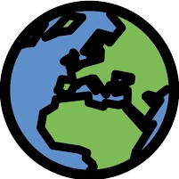
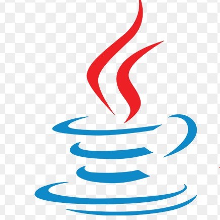

### Hi there, I'm Rubén 👋

## I'm a computer engineer

- 🎓 I finished my engineer degree in the [University of Balearic Islands][uib]
- 🚀 I’m currently working at [ISDEFE][isdefe] as a ciber security engineer
- 🌱 I want to grow as a computer engineer and learn about the newest tecnologies and frameworks
- 🥅 2020 Goals: Work hard in my personal projects ant get them done

### Connect with me:

[][website]
[][email]
[][linkedin]

 

## The fields that I like the most

- 🧠 Machine Learning
- 🤖 Artificial Inteligence
- 👨‍💻 Ciber security
- 💻 Web development
- 📱 Mobile app development
- ☁ Cloud

### Languages and Tools:

[][tensorflow]

[][keras]
 

[][html]

[][css]

[][javascript]

[][typescript]

[][webassembly]
 

[][angular]

[][flutter]
 

[][java]

[][python]

[][cpp]

[][csharp]

[][rust]

[][go]
 

[][graphql]

[][nodejs]
 

[][docker]

[][kubernetes]
 

[][sql]

[][firebase]

[][mongo]
 

[][git]

[][github]
 

[][bash]

[][metasploit]

[website]: https://www.linkedin.com/in/rub%C3%A9n-tobar-nicolau-84761117a/
[linkedin]: https://www.linkedin.com/in/rub%C3%A9n-tobar-nicolau-84761117a/
[email]: mailto:rntobar41@gmail.com

[isdefe]: https://www.isdefe.es
[uib]: https://www.uib.es

[tensorflow]:https://www.tensorflow.org/
[keras]:https://keras.io/
[html]:https://www.w3schools.com/html/
[css]:https://www.w3schools.com/css/
[javascript]:https://www.w3schools.com/js/
[typescript]:https://www.typescriptlang.org/
[webassembly]:https://webassembly.org/
[angular]:https://angular.io/
[flutter]: https://flutter.dev
[java]:https://www.java.com/
[python]:https://www.python.org/
[cpp]:https://es.wikipedia.org/wiki/C%2B%2B
[csharp]:https://docs.microsoft.com/es-es/dotnet/csharp/
[rust]:https://www.rust-lang.org/
[go]:https://golang.org/
[graphql]:https://graphql.org/
[nodejs]:https://nodejs.org/es/
[docker]:https://www.docker.com/
[kubernetes]:https://kubernetes.io/
[sql]:https://www.w3schools.com/sql/
[firebase]:https://firebase.google.com/
[mongo]:https://www.mongodb.com/
[git]:https://git-scm.com/
[github]:https://github.com/
[bash]:https://github.com/topics/bash
[metasploit]: https://www.metasploit.com

